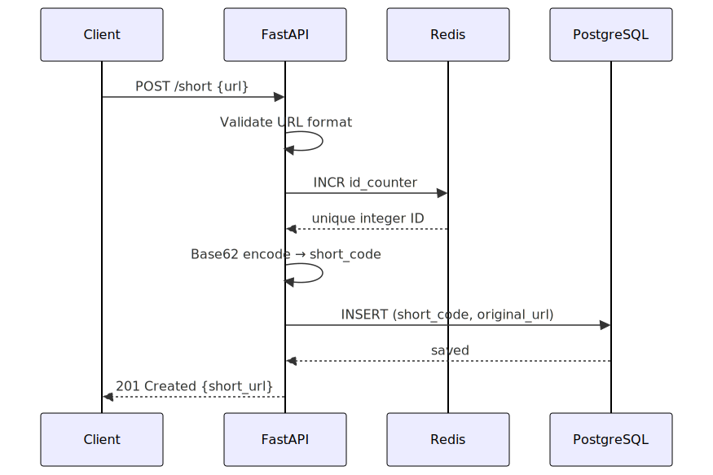
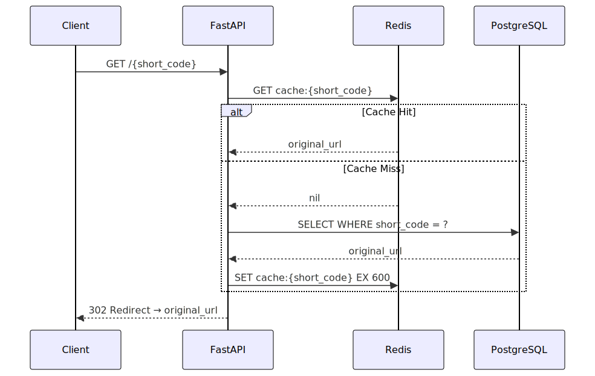

# Shortly

> A fast, scalable URL shortening service built with FastAPI, PostgreSQL, and Redis.

---

## Table of Contents

- [Overview](#overview)
- [Architecture](#architecture)
- [Features](#features)
- [API Reference](#api-reference)
- [Project Structure](#project-structure)
- [Setup & Installation](#setup--installation)
- [Environment Variables](#environment-variables)
- [Database Migrations](#database-migrations)
- [How It Works](#how-it-works)

---

## Overview

Shortly converts long URLs into compact, shareable short links. It is designed for high throughput — using Redis for atomic ID generation and caching, and PostgreSQL for persistent storage.

---

## Architecture



**Request flow — creating a short URL:**



**Request flow — redirecting:**



---

## Features

- **URL Shortening** — converts any valid URL into a compact Base62-encoded short link
- **Fast Redirects** — Redis cache layer for sub-millisecond resolution on hot URLs
- **URL Expiration** — optional expiration time per short link
- **Atomic ID Generation** — Redis `INCR` ensures no collisions across concurrent requests
- **Pluggable ID Providers** — abstract provider interface, currently backed by Redis
- **Database Migrations** — Alembic for schema versioning
- **Input Validation** — strict URL format validation before processing

---

## API Reference

### `POST /short` — Create a short URL

**Request Body**

| Field           | Type      | Required | Description                        |
|----------------|-----------|----------|------------------------------------|
| `url`           | `string`  | Yes      | The original URL to shorten        |
| `expiration_time` | `integer` | No     | Unix timestamp for link expiration |

**Example Request**
```bash
curl -X POST http://localhost:8000/short \
  -H "Content-Type: application/json" \
  -d '{"url": "https://example.com/very/long/path"}'
```

**Example Response** `201 Created`
```json
{
  "original_url": "https://example.com/very/long/path",
  "short_url": "http://localhost:8000/aB3x",
  "created_at": "2026-02-26T10:00:00",
  "updated_at": "2026-02-26T10:00:00"
}
```

**Error Responses**

| Status | Reason                    |
|--------|---------------------------|
| `400`  | Invalid URL format        |
| `400`  | Short code already exists |
| `500`  | Internal server error     |

---

### `GET /{short_code}` — Redirect to original URL

**Example**
```bash
curl -L http://localhost:8000/aB3x
# → 302 redirect to https://example.com/very/long/path
```

**Error Responses**

| Status | Reason              |
|--------|---------------------|
| `404`  | Short URL not found |

---

## Project Structure

```
shortly/
├── app/
│   ├── main.py                  # FastAPI app initialization
│   ├── api/
│   │   ├── __init__.py          # Router aggregator
│   │   └── routes/
│   │       └── main.py          # API endpoint handlers
│   ├── core/
│   │   ├── config.py            # Pydantic settings (reads from .env)
│   │   ├── constants.py         # Application-wide constants
│   │   ├── db.py                # SQLAlchemy engine & session
│   │   ├── redis.py             # Redis client initialization
│   │   ├── providers.py         # ID provider abstraction (Redis-backed)
│   │   ├── services.py          # ShortenerService (business logic)
│   │   └── utils.py             # URL validation & Base62 encoding
│   ├── models/
│   │   └── url.py               # SQLAlchemy Url model
│   └── schemas/
│       └── main.py              # Pydantic request/response schemas
├── alembic/                     # Database migration scripts
│   ├── env.py
│   └── versions/
├── alembic.ini                  # Alembic configuration
├── requirements.txt             # Python dependencies
├── .env.example                 # Environment variable template
└── .gitignore
```

---

## Setup & Installation

### Prerequisites

- Python 3.9+
- PostgreSQL
- Redis

### 1. Clone the repository

```bash
git clone <your-repo-url>
cd shortly
```

### 2. Create a virtual environment

```bash
python -m venv .venv
source .venv/bin/activate       # macOS/Linux
# .venv\Scripts\activate        # Windows
```

### 3. Install dependencies

```bash
pip install -r requirements.txt
```

### 4. Configure environment variables

```bash
cp .env.example .env
```

Edit `.env` with your credentials (see [Environment Variables](#environment-variables) below).

### 5. Run database migrations

```bash
alembic upgrade head
```

### 6. Start the server

```bash
uvicorn app.main:app --reload
```

The API will be available at `http://localhost:8000`.

Interactive API docs are at `http://localhost:8000/docs`.

---

## Environment Variables

| Variable           | Description                              | Example                        |
|--------------------|------------------------------------------|--------------------------------|
| `POSTGRES_USER`    | PostgreSQL username                      | `shortly`                      |
| `POSTGRES_PASSWORD`| PostgreSQL password                      | `yourpassword`                 |
| `POSTGRES_DB`      | Database name                            | `shortly`                      |
| `POSTGRES_HOST`    | Database host                            | `localhost`                    |
| `POSTGRES_PORT`    | Database port                            | `5432`                         |
| `ID_PROVIDER_TYPE` | ID generation backend                    | `redis`                        |
| `REDIS_URL`        | Redis connection URL                     | `redis://localhost:6379/0`     |
| `BASE_URL`         | Base URL for generated short links       | `http://localhost:8000`        |

---

## Database Migrations

Shortly uses [Alembic](https://alembic.sqlalchemy.org/) for schema management.

```bash
# Apply all pending migrations
alembic upgrade head

# Roll back one migration
alembic downgrade -1

# Generate a new migration after model changes
alembic revision --autogenerate -m "description of change"

# View migration history
alembic history
```

---

## How It Works

### ID Generation

Instead of random strings, Shortly uses **sequential integer IDs from Redis** converted to **Base62**. This guarantees:

- **No collisions** — Redis `INCR` is atomic
- **Short codes** — Base62 is compact (7 characters handles ~3.5 trillion URLs)
- **Horizontally scalable** — a single Redis counter works across multiple app instances


### Caching

Every redirect lookup checks Redis before hitting PostgreSQL. Cache entries expire after **10 minutes**, keeping frequently accessed URLs fast while limiting memory usage.

### URL Expiration

Short links can be created with an optional `expiration_time` (Unix timestamp). Expired links return a `404` on redirect.

---

## License

MIT © [Abhas Bind](https://github.com/abhasbind)
